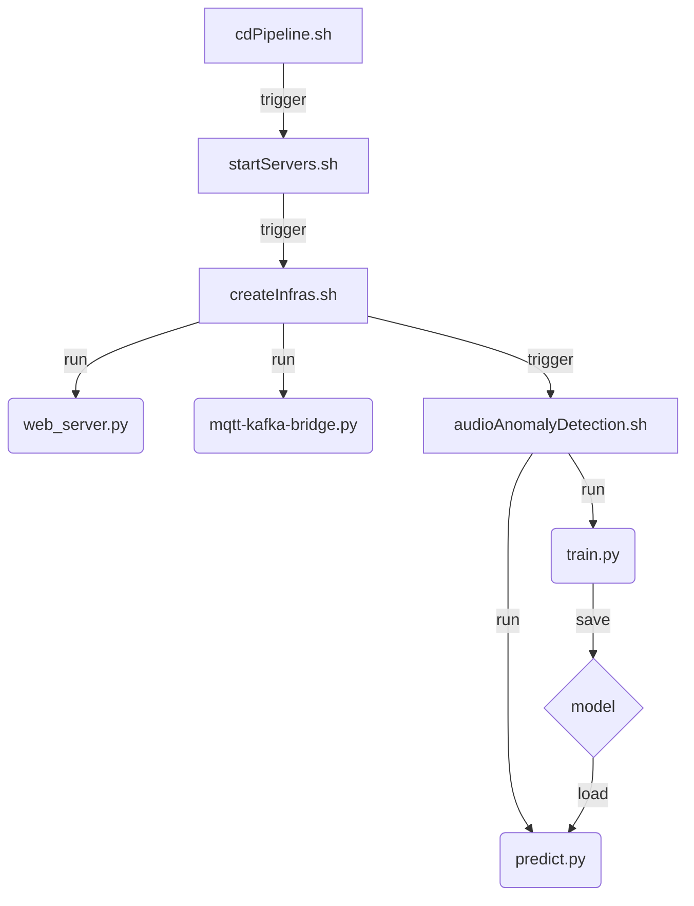

<h1  align="center">Kafka Use Case Anomaly Detection</h1>


**Folder structure of this git repo:**

```bash
root
|________requirements.txt
|________variables.sh
|________pipelines
|            |__________startServers.sh
|            |__________createInfras.sh
|            |__________audioAnomalyDetection.sh
|            |__________cdPipeline.sh
|
|________utils
|            |__________web_server.py
|            |__________mqtt-kafka-bridge.py
|
|________audio_anomaly_detection
|            |__________train.py
|            |__________predict.py
|
|________data
|          |____________normal-data-cleaned.csv
|
|________model
```

---


<h2>I. Files and folders descriptions</h2>

 - `requirements.txt` contains softwares and pip packages that are required for the current use case.
 - `variables.sh` contains **Kafka** topic names which will be created during runtime.
 - `pipelines` folder includes scripts to build sub-pipelines, namely, script to spin up different servers (`startServers.sh`), script to create infrastructure/components needed for accepting data stream (`createInfras.sh`), and script to call python files that take care of training model and inferencing on new stream of data (`audioAnomalyDetection.sh`). The script `cdPipeline.sh` calls previous three scripts to build the complete pipeline.
 - `utils` has a python file that creates a socket server (`web_server.py`) that keep listening on a UDP port, on receiving data from a socket client connected to that UDP port, it parses and sends the message to **MQTT** broker. On detecting a message coming, `mqtt-kafka-bridge.py` forwards the same message to **Kafka** broker, one by one. ==Note that these two files will keep running unless being interrupted.==
 - The folder `audio_anomaly_detection` is where the training and inferencing python files reside. As its name specify, `train.py` trains a deep learning tensorflow model using a training dataset (`normal-data-cleaned.csv`) under `data` folder. Trained model is saved under `model` folder (that's why it is empty). `predict.py` loads the trained model and performs inference on new data; ==it subscibes to a specific Kafka topic, once a new message arrives, it infers on new message and send the prediction to a different Kafka topic.==

<h2>II. Flow chart</h2>


